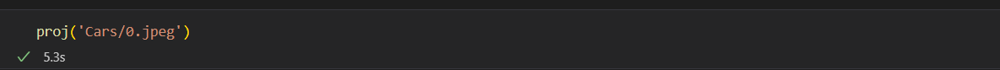

# Licence Plate Detector

### Needed libraries

1. Opencv

2. numpy

3. joblib

4. matplotlib

5. Math

### To Run Project

1. open licence detector.ipynb

2. in the last cell open put image path in proj function

