#  License plate recognition
<div align="center">
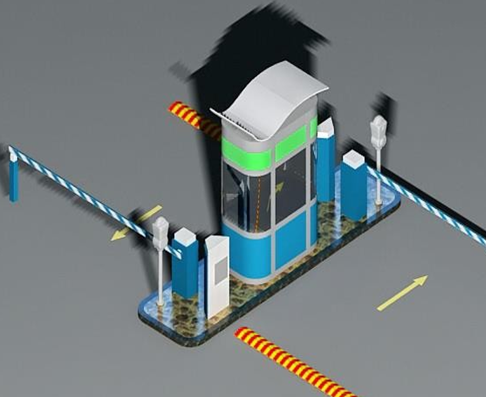
</div>
<br>

                                                                                                
##  Table of Contents

- <a href ="#about"> 📙 About</a>
- <a href ="#Diagram"> :bar_chart: Diagram</a>
- <a href ="#started"> 💻 Get Started</a>
- <a href ="#-image-processing-algorithms-applied"> :mag_right: Image processing Algorithms applied</a>
- <a href ="#modules"> 🌎 Modules</a>
  -  <a href="#-dedect-characters">  Dedect characters </a>
  -  <a href="#Characters-Recognition">  Characters Recognition </a>
- <a href ="#contributors"> ✨ Contributors</a>
- <a href ="#license"> 🔒 License</a>
<hr/>
                     
                     
## <a id="about"></a> About
  <p>
  Our project is <strong>License plate recognition</strong>: A gate is open for specific cars based on their plate number, by capturing images of the car and transform the optical data into digital information [characters] and take a decision.
 </p>

<hr/>

<h2 id="Diagram">Diagram<h2>
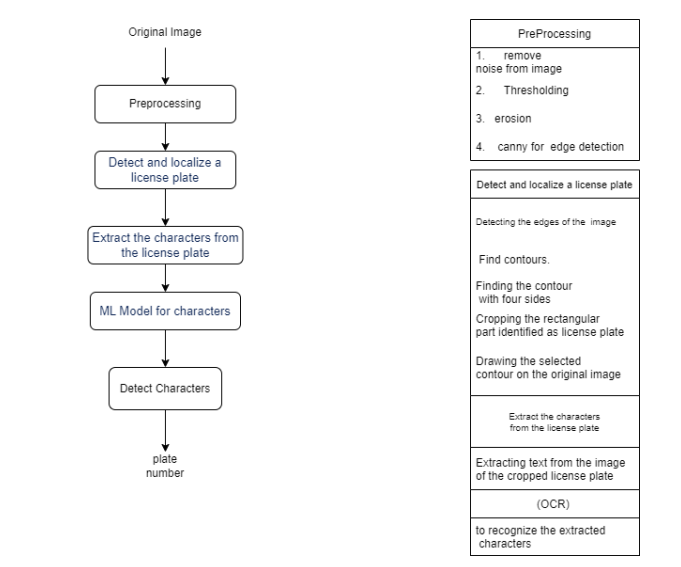
<hr/>
                                     
## <a id = "started"></a>  Get Started 
<ol>
<li>Clone the repository

<br>

```
$ git clone https://github.com/AbdelrahmanAshrafMohamedelsayed/License-Plate-Recognition.git
```

</li>                                                                                                                                       
</ol>
<hr/>     

## <a id="Algorithms"></a> Image processing Algorithms applied
<ul>
    <li>Thresholding</li>
    <li>Segmentation</li>
    <li>Smoothing</li>
    <li>Histogram of gradient (HoG)</li>
    <li>Support Vector Machine (SVM)</li>
    <li>Smoothing</li>
    <li>
        <div>
            <h4>Morphological operations</h4>
            <ul>
                <li>Dilation</li>
                <li>Erosion</li>
                <li>Opening</li>
                <li>Closing</li>
            </ul>
        </div>
    </li>
    <li>Template matching</li>
</ul>
<hr/>  
                     
                     
## <a id="Dedect-characters"></a> Dedect characters
### How dedect the characters from the car
1. ####  **read the image**                            
  <div align="center">
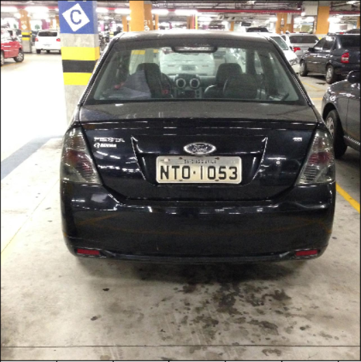
</div>
<br>
<hr/>


2. ####  **Apply image preprocessing**
   1. #####  **convert image to greyscale**                            
   2. #####  **threshold image**                            
   3. #####  **erosion**                            
  <div align="center">
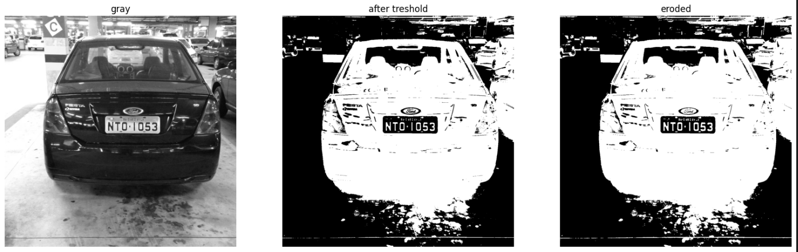
</div>
<br>
<hr/>
                                                                                  
                                                                                  
3. ####  **Apply canny edge detector**                            
  <div align="center">
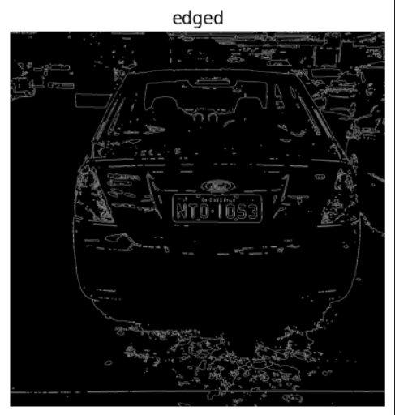
</div>
<br>
<hr/>

                                                                                  
                                                                                  
4. ####  **finding and sort the contours according to their area**                            
  <div align="center">
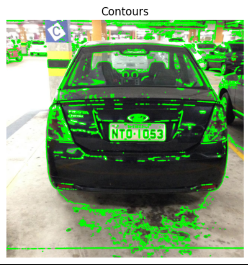
</div>
<br>
<hr/>
                                                                                                   
5. ####  **find the plate**                            
  <div align="center">
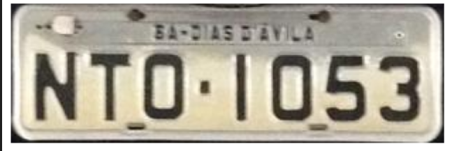
</div>
<br>
<hr/>


6. ####  **extract characters**                            


<table>
<tr>
<td>
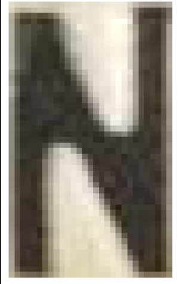
</td>
  
  <td>

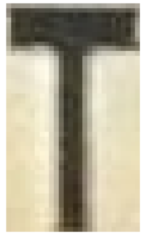

</td>
  <td>

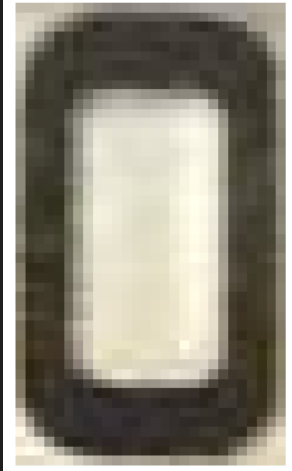

</td>
  <td>

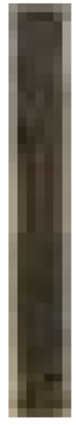

</td>
<td>

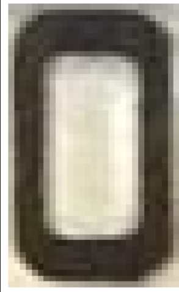

</td>
<td>

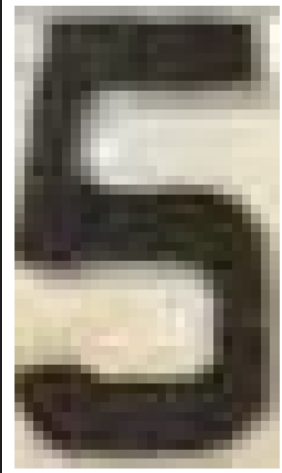

</td>
  <td>

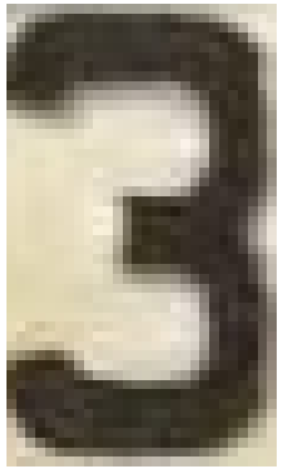

</td>
</tr>
</table>
<br>
<hr/>

## <a id="Dedect-characters"></a> Characters Recognition
### How convert characters images to text by [OCR By Machine Learning]
> this module is itrative and run foreach character
<br>
1. ####  **read the character image**                            
  <div align="center">
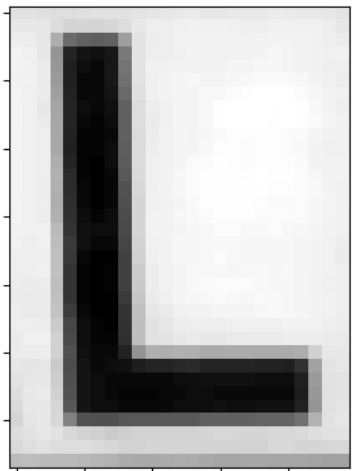
</div>
<br>
<hr/>
